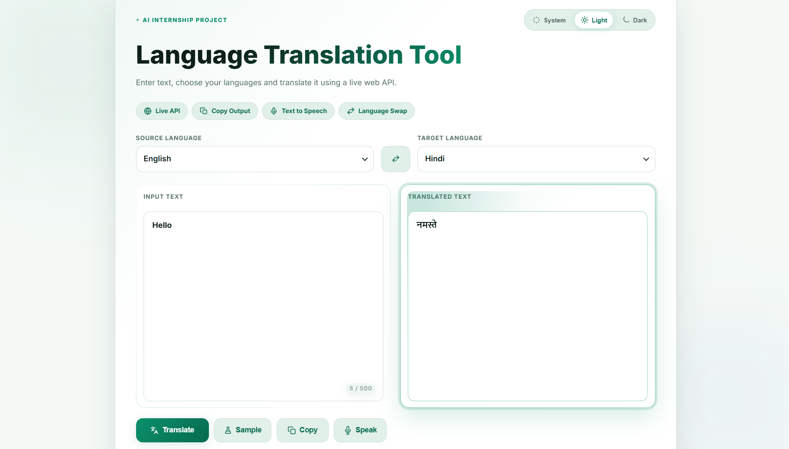
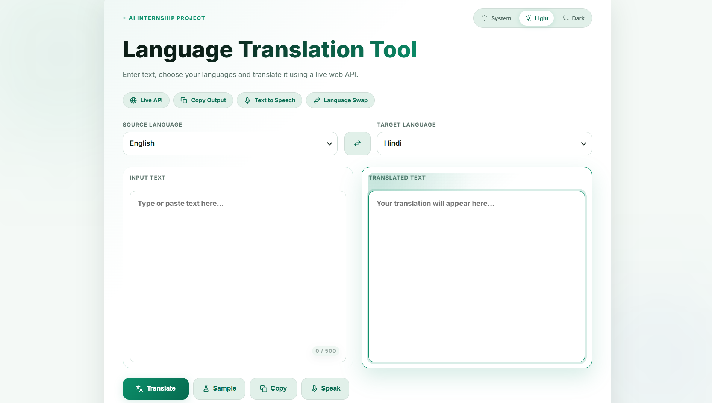
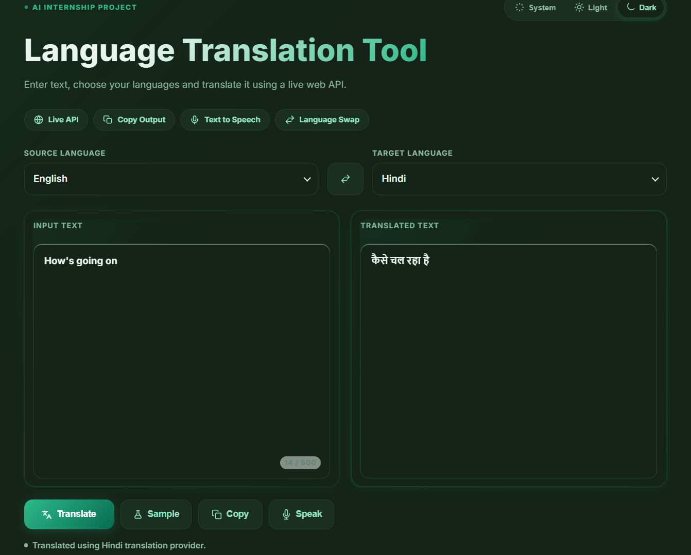

# CodeAlpha Language Translation Tool

A web-based language translation tool built for an AI internship task. It lets users enter text, select source and target languages, and view translated output automatically.

## Live Demo

[Open the deployed project](https://language-translation-tool-sr.vercel.app/)

## Screenshots

### Light Mode Translation



### Light Mode Empty State



### Dark Mode Translation



## Features

- Automatic translation while typing
- Source and target language selection
- Custom styled language dropdowns
- Language swap option
- Copy translated text
- Text-to-speech support
- Dark, light, and system theme modes
- Responsive user interface
- Character counter for input text

## Technologies Used

- HTML
- CSS
- JavaScript
- MyMemory Translation API
- Public Google Translate endpoint for English-to-Hindi translation
- Web Speech API
- Vercel for deployment

## How To Run Locally

Open `index.html` in a browser.

The translation feature needs an internet connection because it uses live translation APIs.

## Project Structure

```text
language-translation-tool/
  assets/
    screenshots/
  index.html
  styles.css
  app.js
  REPORT_NOTES.md
  vercel.json
```

## Internship Task

This project was created for the Language Translation Tool task. It includes a user interface, language selection, API-based translation, translated output display, copy support, and text-to-speech support.
~SR

## Source Code

[GitHub Repository](https://github.com/Shivanshraj1/CodeAlpha_language-translation-tool)
